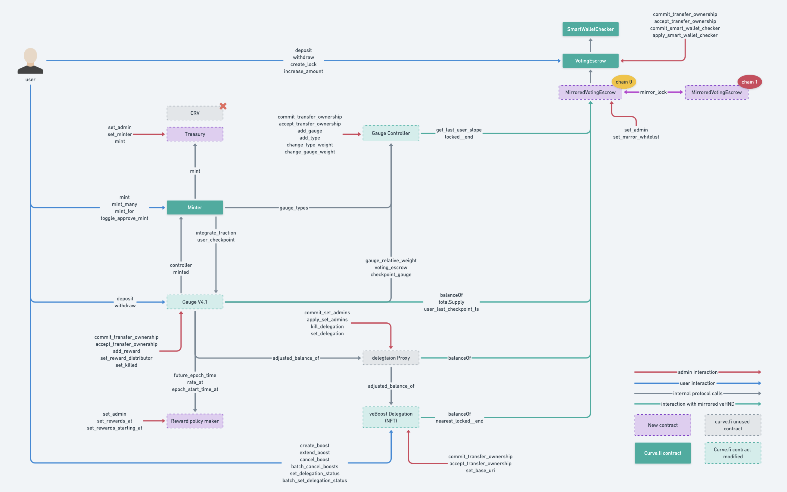

# hundred-dao/contracts

All contract sources are within this directory.

## Subdirectories

* [`testing`](testing): Contracts used exclusively for testing. Not considered to be a core part of this project.

## Contracts

* [`GaugeController`](GaugeController.vy): Controls liquidity gauges and the issuance of HND through the liquidity gauges
* [`LiquidityGaugeV4`](LiquidityGaugeV4.vy): Measures the amount of liquidity provided by each user
* [`RewardPolicyMaker`](RewardPolicyMaker.vy): Defines reward distribution rates and epochs, used by `LiquidityGaugeV4`
* [`Minter`](Minter.vy): Token reward distribution contract
* [`Treasury`](Treasury.vy): holds rewards to be distributed through `Minter`
* [`VotingEscrow`](VotingEscrow.vy): Voting contract for locking HND to participate in DAO governance

Following diagram shows interactions and dependencies between the contracts as well as the user interfaces for 
locking HND, voting on gauges and minting rewards

