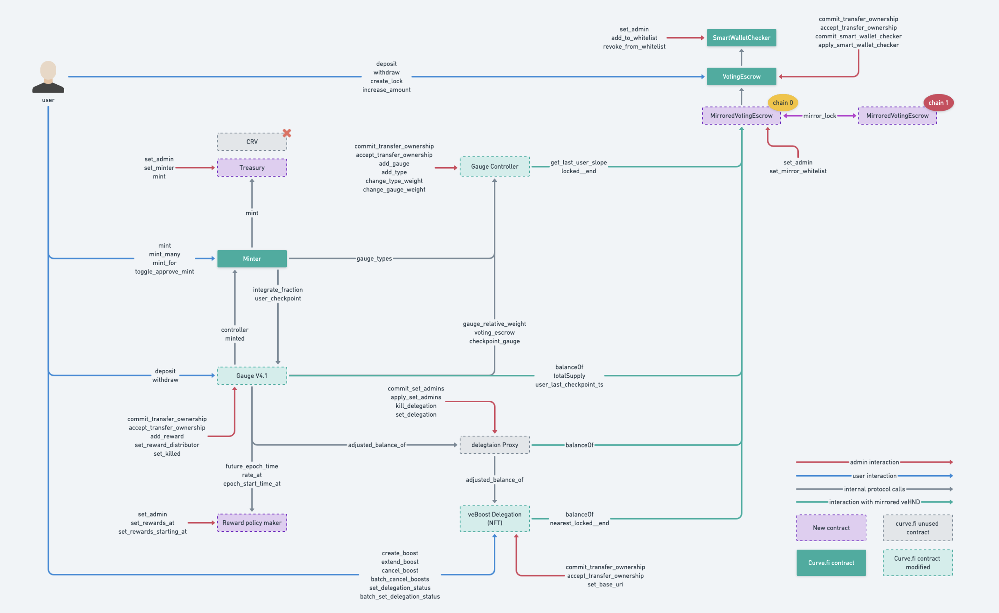

# hundred-dao/contracts

All contract sources are within this directory.

## Subdirectories

* [`testing`](testing): Contracts used exclusively for testing. Not considered to be a core part of this project.

## Contracts

* [`GaugeController`](GaugeControllerV2.vy): Controls liquidity gauges and the issuance of HND through the liquidity gauges
* [`LiquidityGaugeV4_1`](LiquidityGaugeV4_1.vy): Measures the amount of liquidity provided by each user and support veBoost
* [`RewardPolicyMaker`](RewardPolicyMaker.vy): Defines reward distribution rates and epochs, used by `LiquidityGaugeV3_1`
* [`Minter`](Minter.vy): Token reward distribution contract
* [`Treasury`](Treasury.vy): holds rewards to be distributed through `Minter`
* [`VotingEscrow`](VotingEscrow.vy): Voting contract for locking HND to participate in DAO governance
* [`MirroredVotingEscrow`](MirroredVotingEscrow.vy): Aggregates veHND balance from different chains
* [`VotingEscrowDelegation`](ve-boost/VotingEscrowDelegationV2.vy): veBoost contract, enables delegation of unused boost to another wallet
* [`DelegationProxy`](ve-boost/DelegationProxy.vy): voting escrow proxy, to control switch for veBoost usage

Following diagram shows interactions and dependencies between the contracts as well as the user interfaces for 
locking HND, voting on gauges and minting rewards

## Setting rewards

Only `admin` can set/change the rewards

Reward distribution is managed by the [`RewardPolicyMaker`](RewardPolicyMaker.vy) contract, the HND rewards are kept under custudy
of the [`Treasury`](Treasury.vy) contract. 

Rewards are set on a weekly basis (epoch = week), and can only be set/changed for future epochs.

The following is need to set rewards for a given eopch `n`

* call `set_rewards_at(n, amount)`, where `amount` is the HND tokens to be distributed during that epoch
* send the `amount` of HND to the `Treasury` contract

rewards can be set for several epochs in once call using the `set_rewards_starting_at` call in the `RewardPolicyMaker` contract

